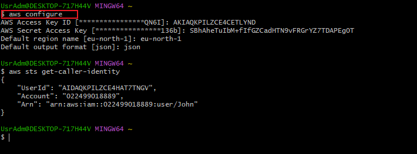
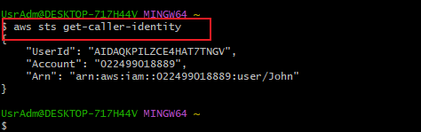
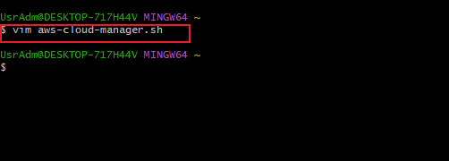
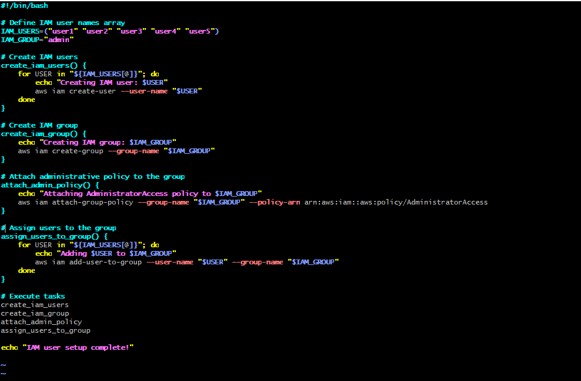
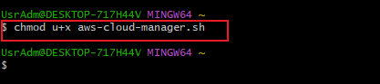
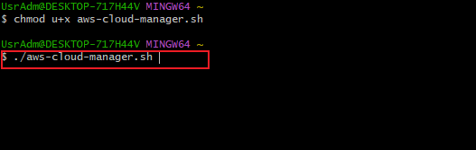
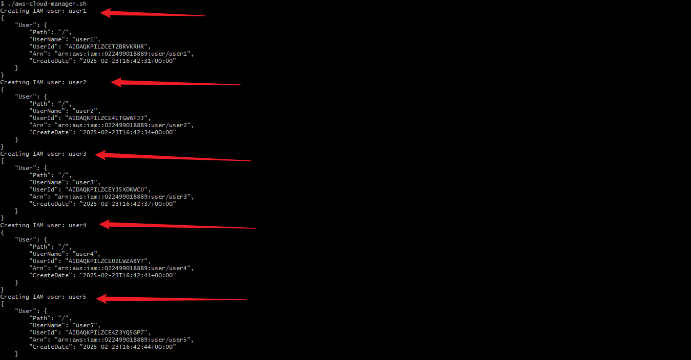
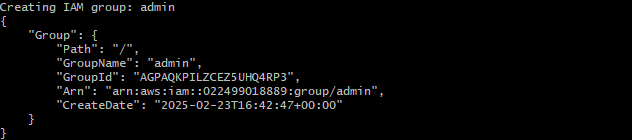
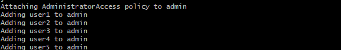
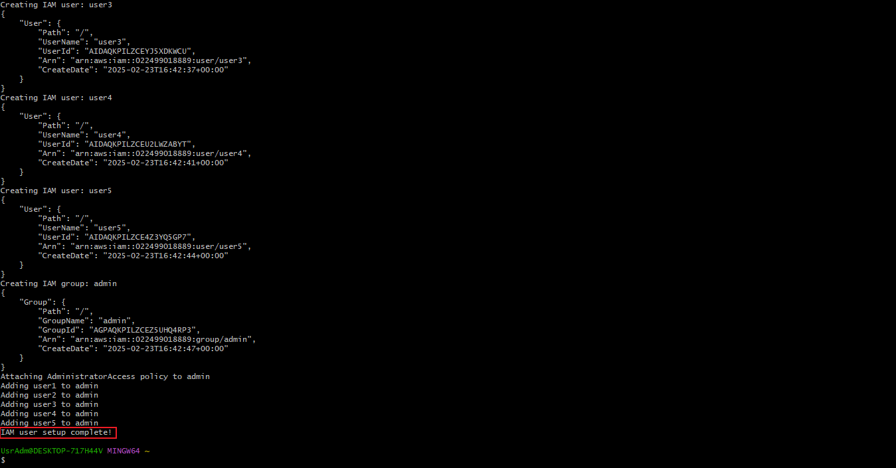

# Linux-Administration-and-Shell-Scripting
This project aims to add more capabilities by creating more functions that extends the `aws-cloud-manager` script.

## The following steps were taken before the IAM user creation.

- AWS Configuration

- Confirmation of AWS Credentials

- `VIM` command to create the `aws_cloud_manager` script

- Content of the Script

- CHMOD command - To give execute right to the user

- Executing the Script

## Define IAM User Names Arrays
### Store the names of the five IAM users in an array for easy iteration during user creation.

- Step 1 - Creating the five IAM users

- Step 2 - Creating the admin group

- Step 3 - Attaching Admin Access

- Setup Complete

